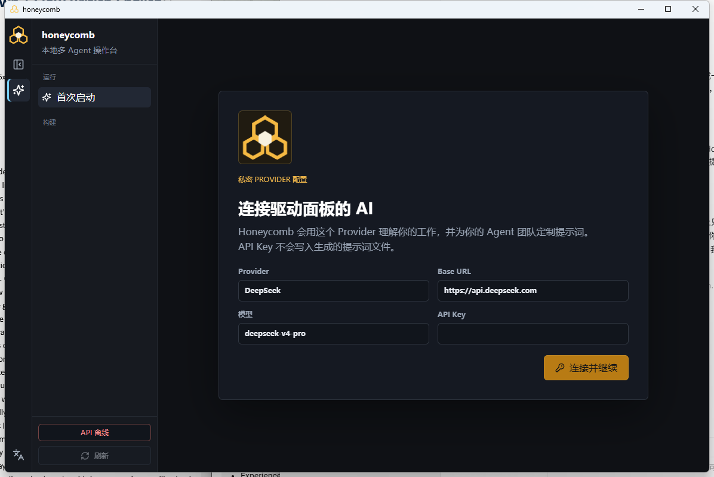

<p align="center">
  
</p>

<h1 align="center">honeycomb</h1>

<p align="center">
  本地优先、可持久化、可检查的多 Agent 编排桌面应用
</p>

<p align="center">
  <strong>让 Agent 团队真正理解你的工作，并让每一次协作都有迹可循。</strong>
</p>

---



## honeycomb 是什么

honeycomb 是围绕 OpenClaw 构建的多 Agent 编排与控制平台。

它不是一个只会把问题转发给模型的聊天面板，而是一套可以长期使用的本地工作系统：

- 第一次启动时，通过渐进式访谈理解你的领域、职业和日常工作；
- 根据你的回答生成适合真实工作的 Agent 团队与提示词；
- 使用四种编排模式组织多个 Agent 协作；
- 用 DBOS 与 PostgreSQL 持久化任务状态，进程中断后仍可恢复；
- 保存任务、消息、阶段产物、评审和完整时间线；
- 在桌面应用中创建任务、检查过程、取消运行和管理配置。

适合这样的场景：

> 单个脚本已经不够可靠，但你又不愿把工作过程交给一个看不见内部状态的托管黑盒。

## 为什么做 honeycomb

许多多 Agent 演示很容易跑起来，却很难长期信任：

| 常见问题 | honeycomb 的处理方式 |
| --- | --- |
| 进程退出后任务状态丢失 | 使用 DBOS 检查点与 PostgreSQL 持久化状态 |
| Agent 之间如何交接不清楚 | 保存阶段、消息、产物和完整时间线 |
| 输出质量只能凭感觉判断 | 使用测试 Agent、验收标准、重试和最终质量门禁 |
| 每次任务都从零开始 | 正在建设经过人工确认的经验记忆与持续学习机制 |
| 配置 Agent 的门槛太高 | 首次启动访谈会生成工作画像与 Agent 提示词 |
| 只能在终端操作 | 提供中文与英文桌面控制台 |

## 当前体验

### 首次启动

首次打开桌面应用时，honeycomb 会先介绍界面，然后进入强制首次配置流程：

1. 单独配置驱动面板的 Provider 与 API Key；
2. 询问你的工作领域；
3. 根据领域生成职业/角色提示；
4. 根据前两项回答生成日常工作选项；
5. 生成工作画像、推荐编排模式和 Agent 团队；
6. 写入本地安全配置后，解锁完整控制台。

访谈答案只用于配置本地面板。API Key 不会写入生成的 Agent 提示词文件。

### 桌面控制台

- 深色桌面应用与可收缩左侧栏；
- 中文、英文界面切换；
- 创建、搜索、筛选和取消任务；
- 查看任务状态、消息、阶段产物和时间线；
- 查看每种编排模式中各 Agent 使用的模型；
- 管理本地密码、密保问题和语言偏好；
- 从桌面 `honeycomb` 快捷方式启动，不显示黑色终端窗口。

## 四种编排模式

| 编排模式 | 适用场景 | 核心行为 |
| --- | --- | --- |
| `supervisor_pipeline` | 默认推荐，重视质量与可控性 | 每个阶段完成后由测试 Agent 评审，失败时重试，必要时等待人工处理 |
| `pipeline` | 步骤明确、追求速度的生产链 | Agent 按顺序传递产物，最后执行整体质量检查 |
| `classic_master_slave` | 主控 Agent 分派多个相对独立的子任务 | 主控负责分派和汇总，子 Agent 分别执行 |
| `master_slave_discussion` | 问题模糊、需要不同观点讨论 | 多个 Agent 进行持久化讨论，再由主控 Agent 综合结论 |

第一次运行建议使用 `supervisor_pipeline`。

## 已经具备的能力

```text
桌面应用          Tauri + React，支持中文与英文
任务 API          创建、查询、列表、时间线、消息、取消
持久编排          DBOS 检查点 + PostgreSQL 业务状态
Agent 协作        四种编排模式、阶段交接和讨论轮次
质量验证          测试 Agent、验收标准、阶段重试、最终质量门禁
产物追踪          任务产物、测试报告、最终结果和完整时间线
首次启动          Provider 配置、工作访谈、Agent 提示词生成
外部入口          HTTP 与飞书适配器
真实运行边界      通过适配器调用 OpenClaw，不修改 OpenClaw 源码
```

## 正在建设

- 从已完成任务中提取原子化经验候选；
- 为经验记录保存置信度、证据、作用域和来源任务；
- 由用户确认后再把经验写入可复用记忆，避免错误经验自动扩散；
- 在后续任务与 Agent 生成过程中检索相关经验；
- 完善真实 OpenClaw 模式下四种编排模式的端到端验证；
- 发布首个可公开体验的 Alpha 版本。

## 快速体验桌面应用

### 环境要求

- Windows；
- Docker Desktop；
- Node.js `^20.19.0` 或 `>=22.12.0`；
- npm `>=10`；
- 构建 Tauri 桌面程序时需要 Rust、MSVC 与 Windows SDK。

### 启动

在仓库根目录执行：

```powershell
npm run tryout:desktop
```

创建桌面快捷方式：

```powershell
npm run tryout:shortcut
```

之后可以直接双击桌面的 `honeycomb.lnk`。应用会立即打开，并在后台检查或启动本地服务。

停止本地体验环境：

```powershell
npm run tryout:stop
```

## Docker 快速启动

```powershell
docker compose up --build
```

启动后包含：

```text
PostgreSQL                         localhost:5432
orchestrator-api                   http://localhost:3000
DBOS worker                        后台运行
```

默认使用模拟 Agent，不会产生真实模型费用。

停止服务但保留数据：

```powershell
docker compose down
```

只有在明确要删除本地状态时才执行：

```powershell
docker compose down -v
```

## 创建一个任务

```powershell
$body = @{
  prompt = '为一个新的 AI 写作工具规划一篇简短发布文章'
  requesterId = 'quickstart'
  routingMode = 'supervisor_pipeline'
} | ConvertTo-Json

$created = Invoke-RestMethod `
  -Uri 'http://localhost:3000/jobs' `
  -Method Post `
  -ContentType 'application/json' `
  -Body $body

$created
```

查询任务和时间线：

```powershell
Invoke-RestMethod -Uri "http://localhost:3000/jobs/$($created.jobId)"
Invoke-RestMethod -Uri "http://localhost:3000/jobs/$($created.jobId)/messages"
Invoke-RestMethod -Uri "http://localhost:3000/jobs/$($created.jobId)/timeline"
```

## 系统结构

```text
桌面应用 / HTTP / 飞书
          │
          ▼
   orchestrator-api
          │
          ▼
      DBOS worker
          │
    ┌─────┴─────┐
    ▼           ▼
PostgreSQL   Agent 适配器
                 │
                 ▼
              OpenClaw
```

| 目录 | 内容 |
| --- | --- |
| `apps/desktop-app` | Tauri + React 桌面应用 |
| `apps/orchestrator-api` | 任务与控制 API |
| `apps/dbos-worker` | 持久工作流、编排模式和 Agent 适配器 |
| `packages/db` | PostgreSQL 数据访问与迁移 |
| `packages/shared` | 共享类型和契约 |
| `examples` | 示例任务与首次配置回答 |
| `platform-assets` | Agent 模板和平台资源 |
| `scripts` | 启动、检查、验证和维护脚本 |
| `docs` | 架构边界、运维和开发记录 |

## 本地检查

```powershell
npm run check
npm run check:no-secrets
npm run build
npm run smoke:desktop-onboarding
npm run smoke:desktop-ui-prod
npm run smoke:tauri-shell
npm run smoke:docker-compose
npm run smoke:http-only
```

真实 Provider 与真实 OpenClaw 验证需要本地配置和明确授权：

```powershell
npm run smoke:m3-real-provider
npm run smoke:openclaw-real
```

检查脚本不会输出 API Key。

## 项目边界

honeycomb 是 OpenClaw 之上的平台层，不是 OpenClaw 的替代品。

正常开发中不直接修改 OpenClaw 或 ClawPanel 源码。真实运行通过
`apps/dbos-worker/src/adapters/openclaw.ts` 适配器边界完成，Agent 模板保存在
`platform-assets/openclaw-agent-templates/`。

## 许可证

本项目使用 [Apache-2.0](LICENSE) 许可证。
